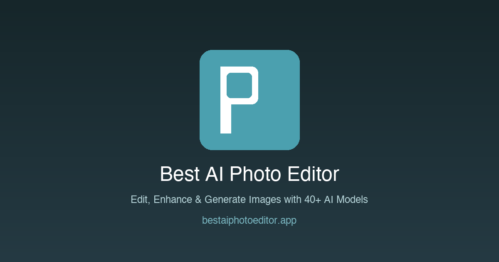

# AI Photo Editor MCP Server

> Best AI Photo Editor - Free AI Image Editor & Generator Online

[](https://nodejs.org)
[](#tools)
[](./LICENSE)
[](https://modelcontextprotocol.io/specification)
[](https://modelcontextprotocol.io)

<p align="center"><a href="https://bestaiphotoeditor.app"></a></p>

A Model Context Protocol server that exposes the canonical AI Photo Editor knowledge surface — image generation workflows and styles, pricing, FAQ, official links — to MCP-compatible AI clients such as Claude Desktop, Cursor, Windsurf, and Continue. Read-only, no API keys, no quota, ~50 ms cold start.

Official website: https://bestaiphotoeditor.app

## 🎨 About AI Photo Editor

Best AI Photo Editor (bestaiphotoeditor.app) is a browser-based photo editing and image generation platform that brings together more than 40 AI models under one roof. Users can remove backgrounds, swap faces, enhance resolution, generate images from text prompts, and even produce short videos — all without installing any software. The service offers 55 free credits on sign-up with no credit card required, and paid plans include commercial usage rights and no watermarks. With over 25,000 users and 1.5 million images processed, the platform positions itself as a single destination for tasks that would otherwise require several separate tools.

## Key Features

- **Multi-model image generation** — access GPT Image 2, Flux Kontext, Nano Banana, Grok Imagine, Ideogram, Seedream, Imagen 4, and Z-Image Turbo from a single interface.
- **Background removal and replacement** — clean cutouts and AI-generated background swaps suitable for product shots and portraits.
- **Face swap and headshot generation** — replace faces in existing photos or generate professional-grade headshots from a selfie.
- **Image enhancement** — upscale and sharpen photos up to 4K resolution; remove unwanted text or objects.
- **AI video generation** — animate still photos or generate video clips from text using models such as Sora 2, Kling, Veo, Seedance, and Minimax Hailuo; output in MP4 at up to 1080p.
- **Fast, cloud-based processing** — edits complete in 5–30 seconds; video renders in 1–5 minutes with no local compute required.

## Use Cases

- **E-commerce product photography** — create clean, studio-quality product images by swapping backgrounds or generating entirely new scenes around an existing product photo.
- **Professional headshots** — produce polished headshots for LinkedIn profiles or company directories without booking a photographer.
- **Marketing content at scale** — generate multiple visual variants for ad campaigns or social media posts by iterating across different AI models with the same prompt.
- **Portrait retouching** — adjust hairstyle, remove blemishes or overlaid text, and enhance image sharpness in a few clicks.
- **Short-form video creation** — animate a product photo or brand image into a brief video clip for social platforms, using AI video models directly integrated into the workflow.

## Who Is It For

Best AI Photo Editor is aimed at people who need quality visual output quickly but do not want to maintain a large stack of specialized tools. That includes e-commerce sellers who produce frequent product images, solo content creators managing their own social channels, marketing teams that need to turn around visual assets on short deadlines, and small business owners who lack a dedicated design resource. The free entry tier also makes it accessible to photographers and digital artists who want to experiment with AI-assisted editing before committing to a subscription. The platform's breadth of models is particularly useful for anyone who regularly compares output quality across different AI systems without wanting to juggle multiple accounts.

## Tools

### `list_styles`
Return the canonical list of image-generation styles or presets the site exposes. (AI Photo Editor)

_Input:_ no parameters. _Returns:_ text/markdown.

### `get_pricing`
Return the canonical pricing entry point for AI Photo Editor.

_Input:_ no parameters. _Returns:_ text/markdown.

### `get_official_links`
Return the canonical list of official links for AI Photo Editor (website, support, docs when available).

_Input:_ no parameters. _Returns:_ text/markdown.

## Resources

- `site://aiphotoeditor/styles` — Supported image-generation styles and presets.
- `site://aiphotoeditor/pricing` — Canonical pricing entry point.
- `site://aiphotoeditor/faq` — Short FAQ generated from public site metadata.
- `site://aiphotoeditor/links` — Canonical URLs to share with users.

## Installation

Clone the repository and point your MCP client at the local entry point.

```bash
git clone https://github.com/<your-account>/aiphotoeditor-mcp.git
cd aiphotoeditor-mcp
pnpm install
```

### Claude Desktop

Add to `claude_desktop_config.json` (Settings → Developer → Edit Config):

```json
{
  "mcpServers": {
    "aiphotoeditor-mcp": {
      "command": "node",
      "args": [
        "/absolute/path/to/aiphotoeditor-mcp/src/index.mjs"
      ]
    }
  }
}
```

### Cursor / Windsurf / Continue

Use the same `mcpServers` block in your client's MCP configuration file.

### Debug with MCP Inspector

```bash
npx @modelcontextprotocol/inspector node src/index.mjs
```

## Official Links

- Website: https://bestaiphotoeditor.app
- Pricing: https://bestaiphotoeditor.app/pricing
- Community: https://x.com/aiphotoeditor
- Support: support@bestaiphotoeditor.app

## Development

```bash
pnpm install
pnpm start                 # run the server over stdio
pnpm test                  # run the package tests
```

## License

MIT
